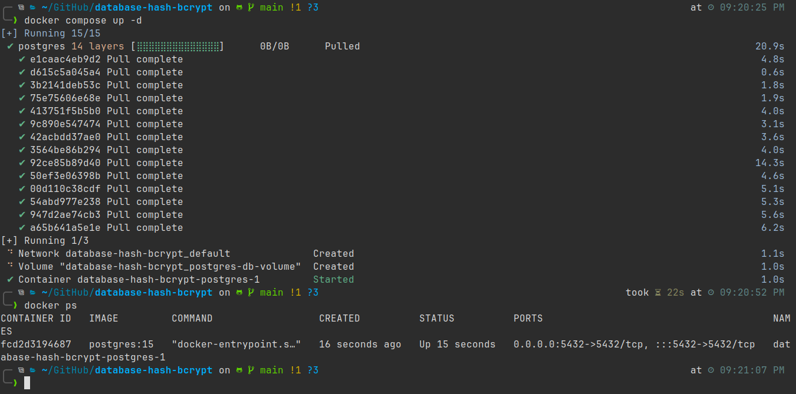
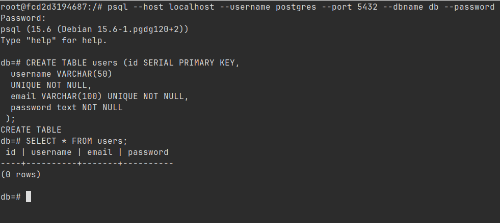
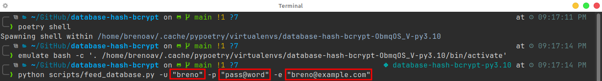
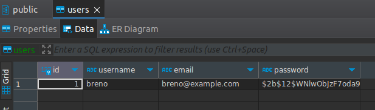
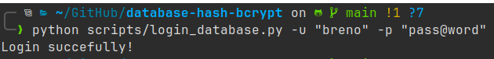
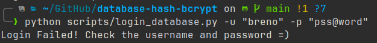

# Database Hashing using bcrypt

A simple application to use [bcrypt](https://en.wikipedia.org/wiki/Bcrypt) as a hash creator for passwords.

This repository was inspired by the video (PORTUGUESE VIDEO): [Deixe as Senhas Seguras no Banco de Dados - Código Fonte TV](https://www.youtube.com/watch?v=ddeyj_Zs8Jc)

# Set-up

## Docker and Docker Compose 

- How to install: [https://docs.docker.com/engine/install/](https://docs.docker.com/engine/install/)

## Python (Poetry)

- How to install: [https://python-poetry.org/docs/](https://python-poetry.org/docs/)

- And run: `$ poetry install`

# Running

## Creating Postgres Database

```console
$ docker compose up -d
```

 

## Creating table

- Copy the CONTAINER ID from `docker ps` command. In my case, it is `fcd2d3194687` (figure above)

```console
$ docker exec -it <your-container-id> bash

# psql --host localhost --username postgres --port 5432 --dbname db --password

db=# CREATE TABLE users (id SERIAL PRIMARY KEY,
  username VARCHAR(50)
  UNIQUE NOT NULL,
  email VARCHAR(100) UNIQUE NOT NULL,
  password text NOT NULL
 );
```



- Now, the next step is to insert a new user using Python

## Insert data into database

1. Active the virtual env, in my case, I am using Poetry: `$ poetry shell`
2. Run the [scripts/feed_database.py](scripts/feed_database.py) with the required arguments:

```console
$ python scripts/feed_database.py -u "breno" -p "pass@word" -e "breno@example.com"
```



- Change the values as you want



## Verifying the password

1. Run the [scripts/login_database.py](scripts/login_database.py) with the required arguments correctly:

```console
$ python scripts/login_database.py -u "breno" -p "pass@word" 
```



2. Run the [scripts/login_database.py](scripts/login_database.py) with the required arguments wrongly:

```console
$ python scripts/login_database.py -u "breno" -p "pss@word"
```



---

<div style="text-align: center;">
🛠️ Created by <strong>BrenoAV<strong> 🚀
</div>